Hello friends!

So summer is finally coming to an end, which is total madness! Where did those four months go? 
As a final 'hurrah' before we go back to college, my boyfriend & I took a trip to the beautiful county of Clare for a couple of days. 
We got extremely lucky with the weather. It's currently mid-September in Ireland, which 90% of the time means either wind, rain, or both. However by some miracle we enjoyed three days of SUN and not a rain cloud to be seen!

The main 3 attractions that we went to see were The Cliffs of Moher, the Aillwee Caves and then, my personal fave, Bunratty Castle and Folk Park! 

Rather than write out a big post going into detail about everything we did, I'll just include the photos so that you can see for yourself!

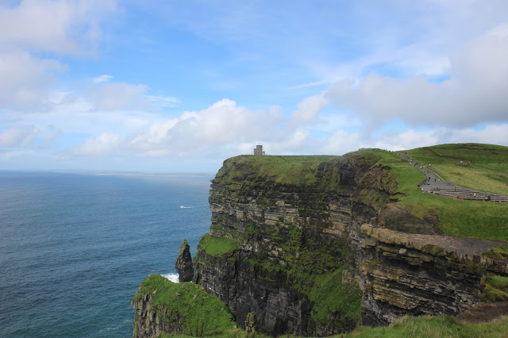
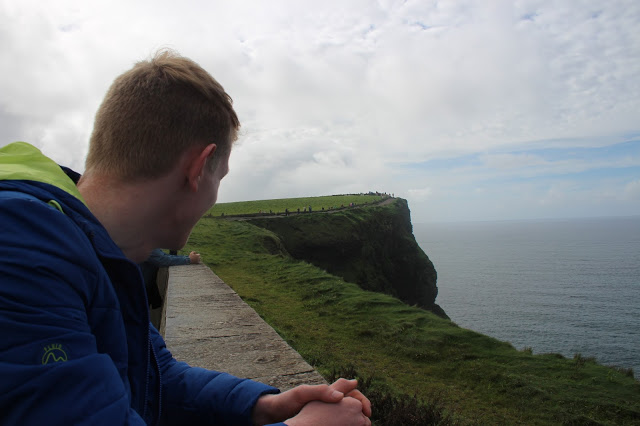
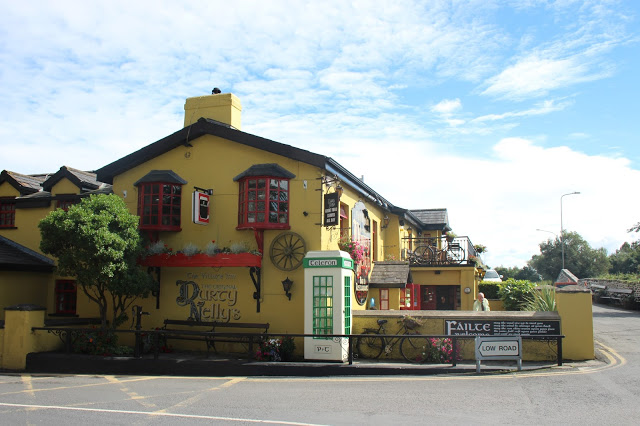
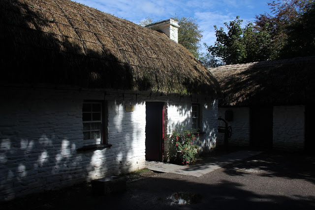
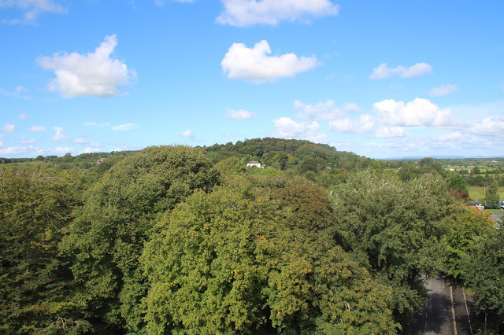
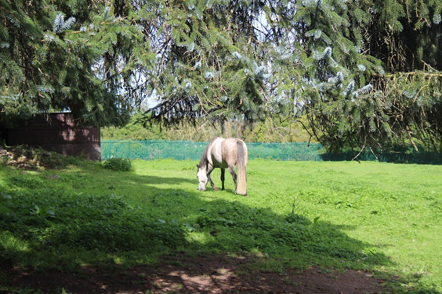
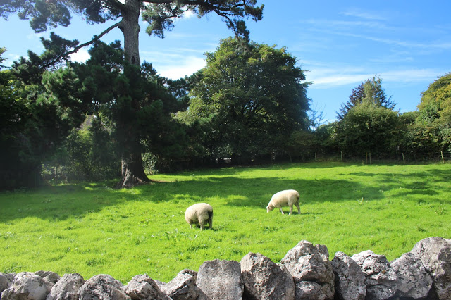
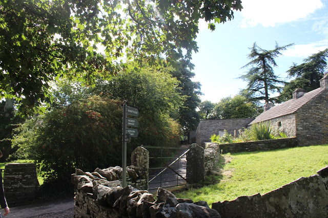
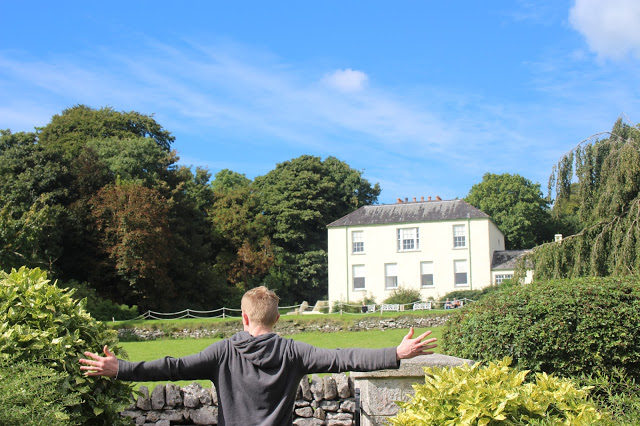
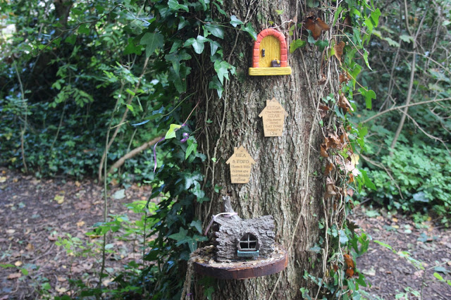
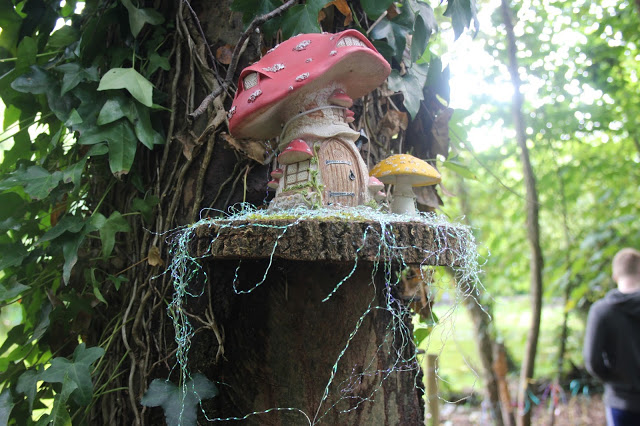
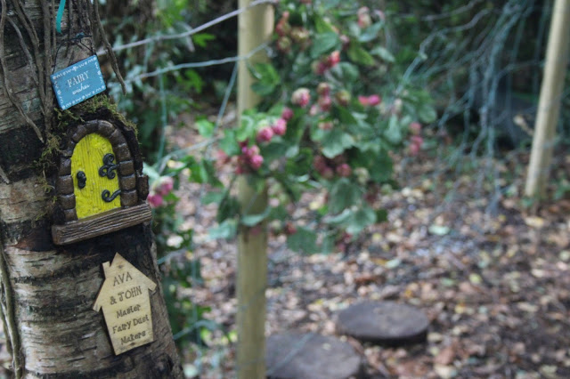

It's funny, because despite living in such a beautiful country my whole life with so many fantastic attractions to see and do, I really have not taken the time to explore the half of it. Why do we take for granted what is on our doorstep? Why are we in such a rush to jet off to countries abroad when there is so much unseen, exactly where we are? I'm 20 years old and have only gotten around to seeing the world famous Cliffs of Moher this week!

I'm thinking another road trip around Ireland is on the cards soon!
