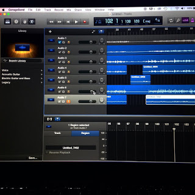
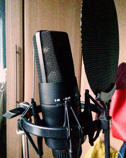

Hello friends! 

First things first. Last night I uploaded a cover of 'Stitches' by Shawn Mendes to our youtube channel. I was originally planning on uploading a cover of 'Here' by Alessia Cara, but no matter what I did, the cover just didn't sound right. Nevertheless I quickly recorded 'Stitches' and the feedback has been great... you lot are sound! 
 
===

ALSO! Last night, I was comfortably sitting in my jammies, drinking tea, watching The Ray Darcy Show when I got an overly excited phone call from Megan.Within in no more than two minutes of the cover being uploaded last night, we went from 98 subs.. TO 104 SUBS. I know many people think that's a small number, but honestly to reach over one hundred subscribers on a channel that is only up and running less than 3 months, it's pretty damn cool. So thank you to anyone who has subscribed, who watches the videos, reads the blog posts, or simply gives the videos a share every now and again. Again... you lot are sound! 

And finally (I know, why are you blog posts always so short, gawd Al), demos! I visited Barry last weekend and we put the final touches to Hunting Game. Now, I have to create some harmonies and backing vocals for this song. In case you didn't already notice from my covers on the channel, harmonies are something I've only got comfortable with recently. But, Barry has given me some advice, plus when in doubt I'll just add an 'oohhhh' or an 'aaahhh'. Also, recording the main melody of the chorus twice, and playing them over each other makes such a difference and really makes the chorus song stronger. I tried it out in my 'Stitches" cover, which you can watch below!

That's all for now folks, 

Take care,

Alice