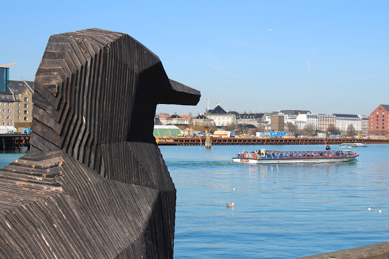
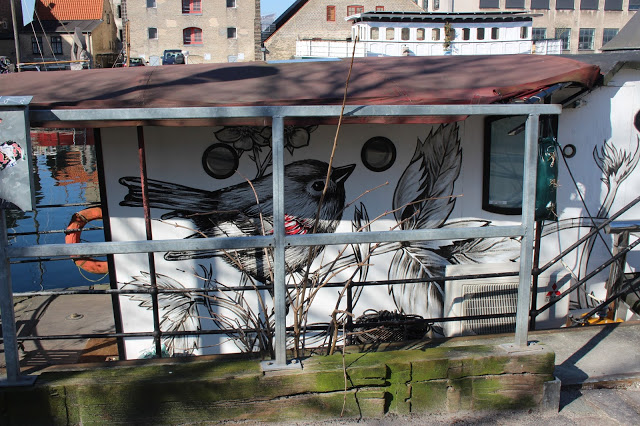

TWO blog posts in one week? Sure I'm mad altogether.

As some of you might already know, I spent the past week in Copenhagen visiting my brother, with one of my best friends, Éadaoin. My brother is studying abroad there this year, and so we thought, when will we ever have an excuse to go to Denmark again?

===

Just like Paris, we chose to find an apartment on Airbnb for the week. I have never been more impressed. We were so lucky to find the apartment that we did. We had ended up booking accommodation quite late, so to find the apartment that we did was a miracle, because we struck gold. It was a beautiful and spacious apartment, and it had A BALCONY. Such a gem! The pictures I took really do not do it justice, but it had such a cool vibe. I think both myself and Éadaoin basically fell in love with the place and pretended every evening for the entire week that this was our life. Honestly, one of my favorite parts of the holiday was just getting back to the apartment after a day of sightseeing and just cooking food and watching films in our super cool sitting room, on our super cool couch. I've included a couple photos of the apartment below!

Copenhagen was without a doubt one of the nicest places I have ever been to! So picturesque (Really, it has literally taken me hours to pick the photos for this blog post. There were so many to chose from).The weather for the week was just perfect. Not a single drop of rain the whole week long.  I even had to pick up a pair of sunglasses. How did we get so lucky?!

We packed a whole lot in during our week away. Some of the highlights were the Carlsberg brewery (priorities), St. Patrick's Day, the National Museum of Denmark and taking a boat cruise around the city.  I don't want to give away EVERYTHING that we got up to on this blog post, because I'm working on a vlog that I shot during the week which has pretty much everything we got up to during the week. It's not completed yet, but I'll include a lil sum' sum' for you to enjoy until that's finished.

When chatting to people about our upcoming trip, so many people had told both myself and Éadaoin to brace ourselves for the massive dent in our bank account after spending a week in Denmark. Pretty much everyone we spoke to told us that it was going to be super expensive. However, I really didn't think that was the case at all. We definitely didn't deprive ourselves; we went and did everything we wanted to see/do, and we certainly ate well throughout the trip, but I don't think it cost all that much! I think if you're smart, and maybe buy the odd dinner/lunch to cook in your apartment (another benefit of Airbnb over a hotel), you will save a small fortune.

I was also told by a number of people that the Danish people may come across as slightly serious (not rude!), and very to-the-point. Again, from my own experience I could not disagree with this more; everyone was just lovely! The people working in the National Museum of Denmark particularly stuck out in my mind. I was genuinely blown away with the friendliness and helpfulness of each and every member of staff. They were so warm and greeted us with genuine smiles from ear to ear.Lovely humans, every one of them!

So that was Copenhagen! Keep an eye out for the vlog which I will be posting in the next few days. I now need to spend the next few months working/saving so I can go away again ASAP. I have caught the travel bug, and I got it BAD. 

