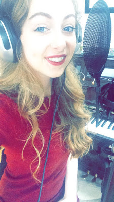
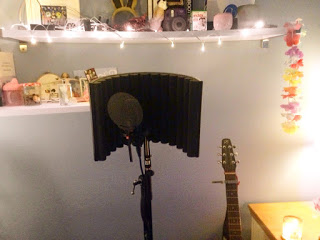
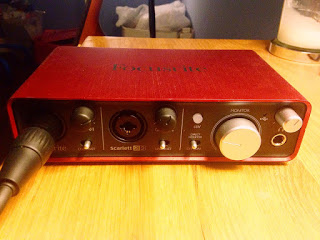
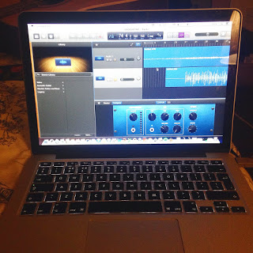

Hello, Alice here! Welcome to my first blog post! I haven't got much of an introduction, so I'm just gonna launch straight into it!

===

Myself and Megan are so excited to finally get started on out One Year Project now that exams are over! My goals with The One Year Project 2016 are mainly music, song writing and radio orientated... with the occasional outlier!

This post is mainly to do with my first cover on the new channel: The One Year Project

It's my first time EVER using my new recording equipment and needless to say I am in no way a sound engineer: I didn't realise how tedious the experience would be!

My first few takes I experiences a bit of pitching in the vocals which takes a bit of getting use to! I recorded the guitar using the condenser mic, rather than plugging into the interface (I just prefer the sound that way!!). 

I recorded my cover, Radioactive by Imagine Dragons, using a condenser mic, soundproof booth, Garageband, and the Focusrite Scarlett2i2 audio interface (all pictured above). A bit of a mouth full isn't it?

The video is available to watch below, where you will also find a link to my soundcloud, and of course subscribe if you haven't already!

