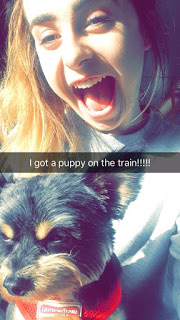
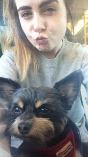

Hello there, friends!

It's been quite some time since you've heard from us on the blog, and I apologize for that. It seems that the last couple of months in University just completely took over. 

===

We have both been incredibly busy finishing assignments and then studying for our end of year exams. If you have been following the YouTube channel though, we have tried our best to be as active as possible over there!

Anyway, I had a blog post that I wanted to write around exam time. I feel it's an important one, even though it's late, so I hope you enjoy!

So, a couple of weeks ago, on my way back to University to begin my exams (ew), I had the most random, but lovely encounter on the train. 

To summarize events very briefly, I had been on a massive high all of that weekend because of the success of our Love Yourself video (linked below). However, just as I got on the train, I received a text message, the contents of which I won't get into, because it's not important. All you need to know is that it wasn't pleasant and put me in a really terrible mood. 

Anyway, I got on with things and hopped onto the train with one of my friends. It was pretty crowded, as it always is on a Sunday evening with all of the students going back to University. The only two seats that I could see were beside two guys, both of which were carrying a PUPPY on their lap! 

Now, maybe in other countries, pets on a train is a common thing, but not in the West of Ireland (lol). So purely because it was such a novelty, we of course decided to sit beside these two random guys with the puppies. 

So all was well. We were sat beside two puppies and therefore we may have mentioned aloud a few times how cute they were. We weren't making it half obvious how much we wanted to pet them. After about 5 minutes of us dropping very obvious hints, the guy sitting beside me asked me if I wanted to hold one of the dogs (SQUEEEEEEE!). "She's your problem for the next two hours" he said and started laughing. We then got talking to the owners and learned a little bit more about their dogs, and what they were doing on our side of the country for the weekend. They turned out to be two of the nicest people I have ever met, no exaggeration. We chatted non stop for nearly two hours. We took selfies with the dogs (which I included for your enjoyment) and we made all the other people on the train super jealous (mwhahaha). 

I think it must have been pretty clear that I was still a little bit bothered about what I mentioned earlier, and while discussing it for a moment with my friend opposite me, the guy beside me turned to his bag on the floor, pulled out a selection box of chocolates (no, I'm not kidding), and says "Here, take your pick, it sounds like you're having a rough time. You definitely need this". Like... WHAT? I mean it was the simplest gesture, but it was just so nice?

Eventually we got to our stop, reluctantly handed over the dogs, and said our goodbyes. Unfortunately I never asked for their names, and I kind of wish I had, thinking of it now. 

The point of this blog post is to highlight how important it is to just be nice. You never know how someone might be feeling, and the power you may have to change their mood. I never even got their names, but these two strangers made such an impact on me, and how I was feeling. I just wish I had told them!

I guess I feel that by writing this blog post, even though the likelihood of them seeing this is extremely slim, I am thanking them for their random act of kindness. 

Thank you for cheering up a very sad gal on the train. You made my day. 

