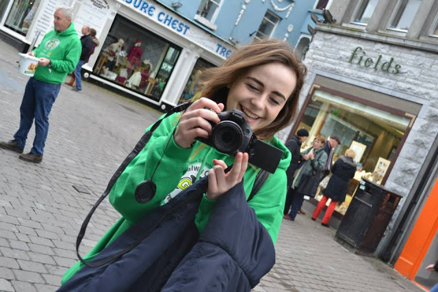

Welcome to The One Year Project! Allow us to introduce ourselves...

Our name’s are Alice Kiernan and Megan Daly. We’re 2nd year University students in Ireland.

===

In December of 2015, after quite the deep and meaningful conversation while waiting on one of our lecturers to arrive to class, Megan and Alice got onto the topic of what we were going to do when we were finished in college. Everyone in the class seemed to have their plan in life. They knew exactly what they wanted to do and where they wanted to go. Study hard. Get a good degree. Get a good job. 
For the the two of us, however, we have always felt like this wasn't exactly how it was going to go for us. The idea of finishing college and going out to work in a 9 to 5 job just never seemed like something that either of us wanted. From the get go we have both always wanted to do something different. It's more than just a dream, it's a gut feeling.

Megan has been watching Youtubers and wanting to start making her own videos for years, but never had the guts to do it until now. Alice has been gigging around Dublin and Ireland since she was 16, and wants to begin the process of producing her first EP, and be taken seriously as an artist. I don't remember how exactly we decided, but we both understood where the other was coming from, and so we decided that we would work together achieve our goals. This is the One Year Project.

We have given ourselves 365 days to achieve a number of goals, both as a team as well as on our own individual projects. We are using this blog, and our own YouTube channel to document this progress as the year unfolds. 

Megan is an aspiring youtuber and film maker. She is the creative director behind ‘The One Year Project’ videos and has a strong passion for editing, visuals and acting. 
In one year, she hopes to gain an online following based on her creativity, as well as begin the process of creating her first short film.

Alice is an aspiring singer songwriter. She has been gigging around Dublin and Ireland since she was 16. 
In the next year, Alice wants to begin the process of her first EP and radio tour. She will document her progress on the EP and gigging throughout the year.

Together we share a drive to show our creativity on various social media platforms ( personal and joined). Although our goals may be different, our ambition stays the same and enables us to work on projects together and individually. 

Last week we shot our first video where we performed anonymous random acts of kindness across our college campus in the promotion of mental health. Please check it out below and subscribe to see more! 

