Paris. To sum it up in one word? Breathtaking. Even though it was only a short holiday, I can say that without a doubt, it was one of the best holidays I have ever been on. Booking flights to Paris at the end of 2015 was one of the most spontaneous things I have done. No prior planning to buying these tickets. Completely spur of the moment thing... and I couldn't be more glad that I did it!

Our flight over was at 6am, resulting in no sleep before the flight, during, or for QUITE a while after. I'm pretty sure I went about 36 hours without sleep, but it was worth it! I will admit I may have been ever so slightly delirious by the end of our first evening (check vlog for that...). But with such little time to see the city, we just had to push on through! It's safe to say that we were all tucked up in bed before 9pm that evening!

Rather than staying in a hotel, we decided we would book an air b&b, something we had never done before. This is basically where locals rent out their apartments to tourists for the week. And I highly recommend it! Firstly, it's very cheap if you're on a budget. We were smack bang in the center of the city, whereas a reasonably priced hotel could be miles and miles out of the city. This meant we were also saving time and money on travelling in and out of the city. The apartment itself was lovely, and the lady who rented it out to us was also wonderful. I think it was just really nice to speak to someone who really lived in the city. She was able to recommend the best things to see/do (and most importantly, where to eat!). 

We were much more rested for our second day in Paris (12 hours of sleep!). The first thing on our list was to see the catacombs underneath the city. After a few wrong turns and some terribly spoken French on my behalf, we managed to find it eventually. It was fascinating to see the catacombs, and certainly something different to do if you have time. A bit eerie and I don't think I would recommend it to you if you're a tad claustrophobic, but if you're feeling brave it is absolutely worth seeing. The tour is not guided, and is instead delivered by using a small MP3 device, so you can listen and walk around at your own leisure which I really enjoyed, because there's nothing worse than being rushed to the next area during a guided tour. I want to take my time! Just don't forget to bring your earphones as they're not included on the tour!

After the catacombs, we had intended to go to a cat café, and spent a good hour trying to find one. When we finally arrived at the 'Cat Cafe', sadly we were told that it didn't actually include any kitty cats! As you can imagine, I wasn't impressed hahaha. We were told that there was an actual cat cafe, but it was nowhere near where we were, so unfortunately we had to abandon that one. It's still on the bucket list though... some day! Despite not getting to see the cat cafe, we did however stroll into a pet shop along the river, where we saw the most adorable and sweet little kittens and puppies. They would melt your heart! I think that made the absence of the cat cafe a lot more bearable.

For the evening, we got some dinner, then we enjoyed a really lovely cruise along the riverside. This was the perfect way to spend our last evening in such a beautiful city. We also got the chance to see the Eiffel Tower during night time, and it is so much more beautiful! I think the cruise may have been my favourite moment of the entire trip. Cruising along the river in the city of Paris with the Eiffel Tower sparkling at night time. Definitely one of those pinch-me moments!

We took it easy on our last day. We had a well deserved lie in, and then we packed our bags and said goodbye to our apartment. We spent the day looking around the shops, picking up a couple souvenirs, and then we used our bus tour ticket to take one last drive around the city. I'm really glad we did the bus tour a second time. When we did it the first day we were in Paris, we were all so sleep deprived that I don't think we were able to concentrate and truly take it all in! 

I was also really glad that I had decided not to vlog that day. I was able to spend the entire day just enjoying the sights and not worrying about trying to capture it all on film. We flew back to Ireland that evening, and it is on the plane home that I am currently writing up this post. Watching clips of our little holiday and I'm already feeling those post holiday blues. I can't wait to share my photos with you!

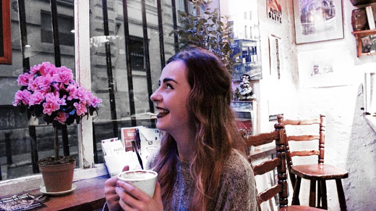
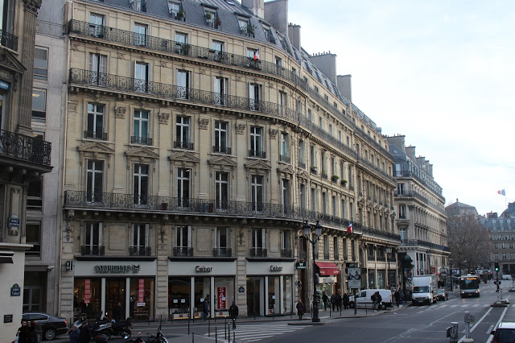
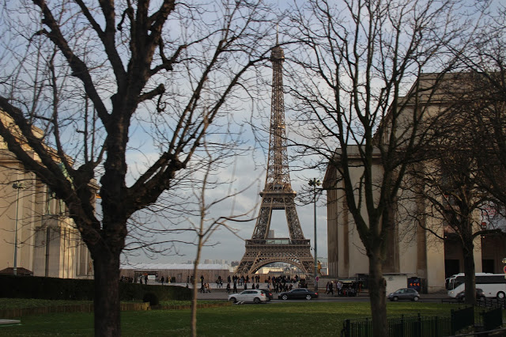
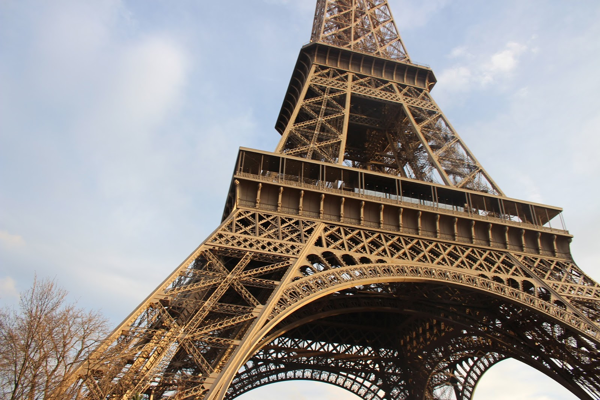
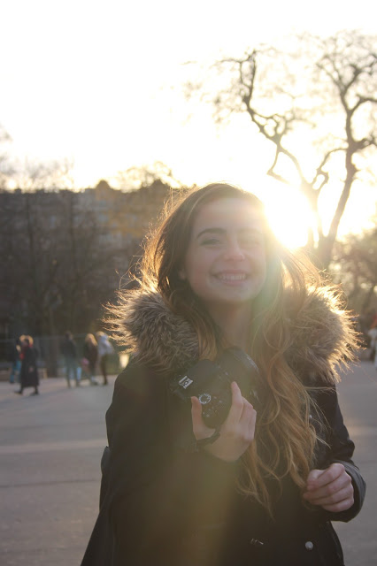
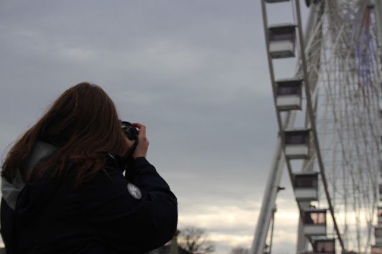
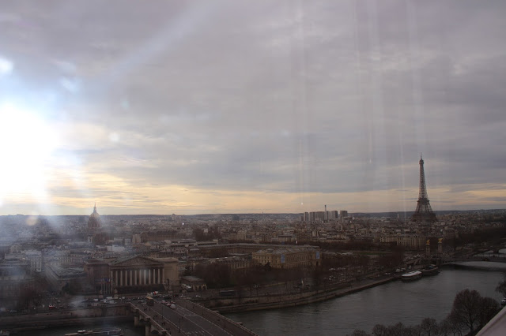
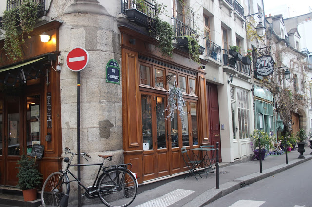
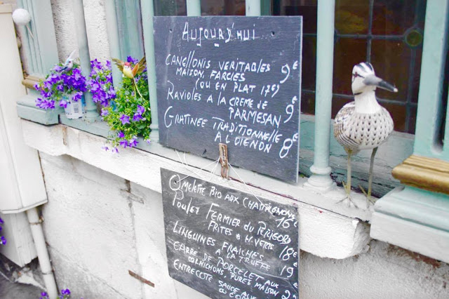
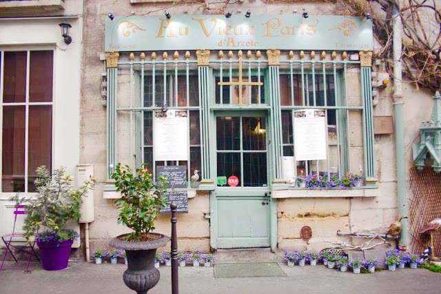
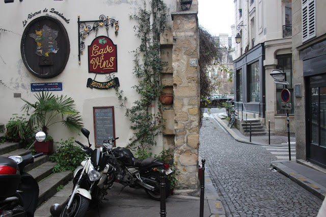
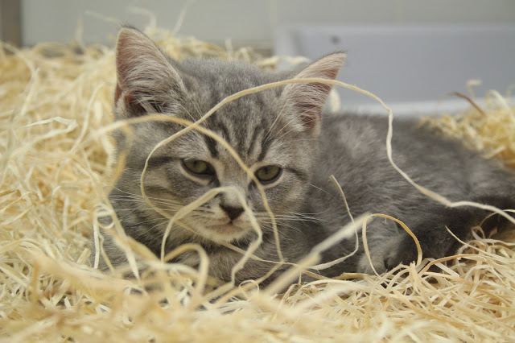
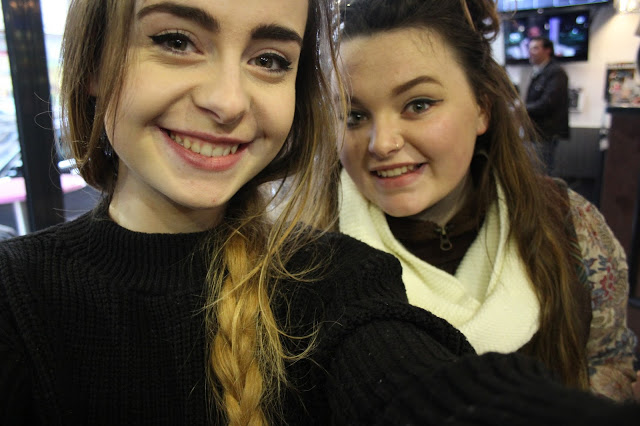
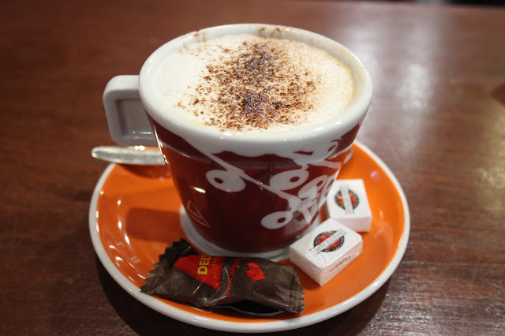
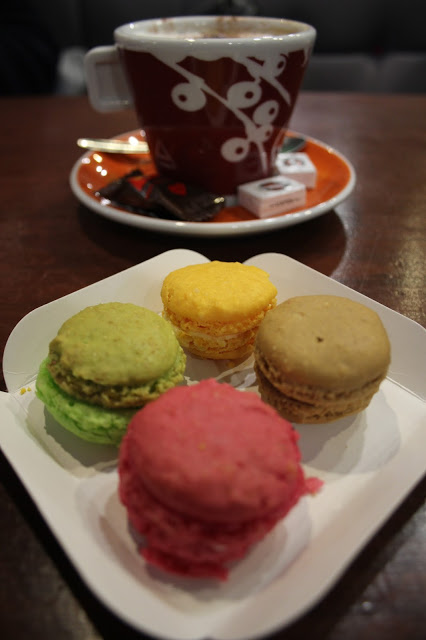
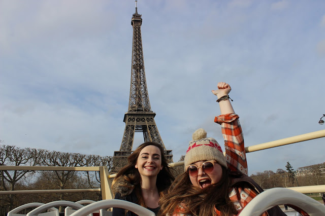
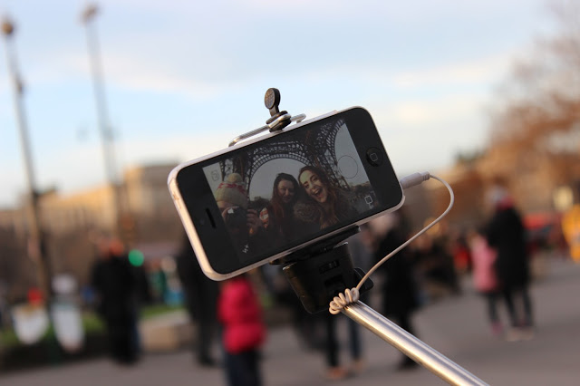
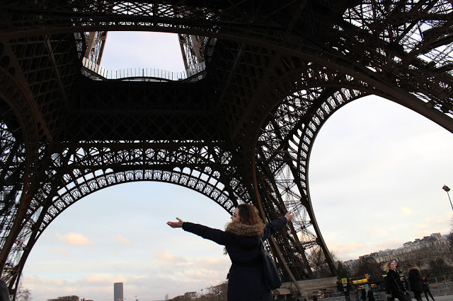
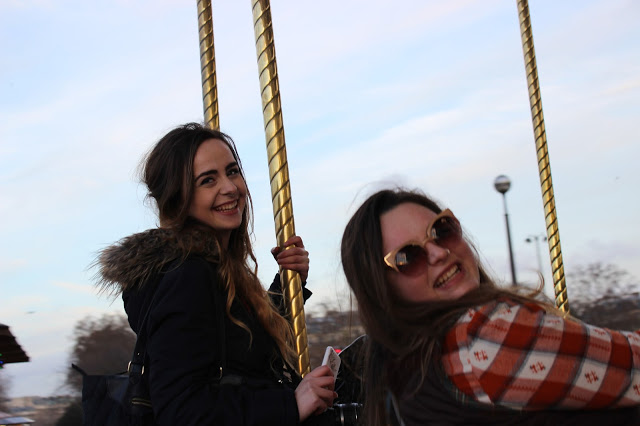
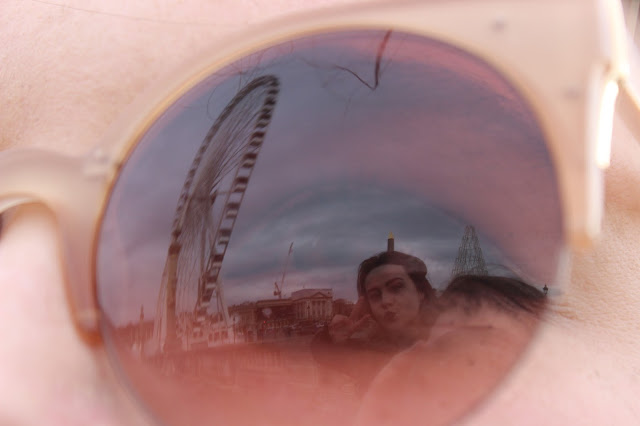

I also vlogged the whole experience, which I will also link below if you want to see more of what we got up to!

<iframe width="560" height="315" src="https://www.youtube.com/embed/GsemOAvNwLM" frameborder="0" allowfullscreen></iframe>

We stayed in Paris for only two nights, so we packed a LOT into those 2 and a half days, as you can see! I absolutely fell in love with the city, as I'm sure everybody does! My only regret is that we didn't stay longer, as there was so much more that we all wanted to do and see. I will be back very soon!

J'taime Paris...

à bientôt,

Megan

