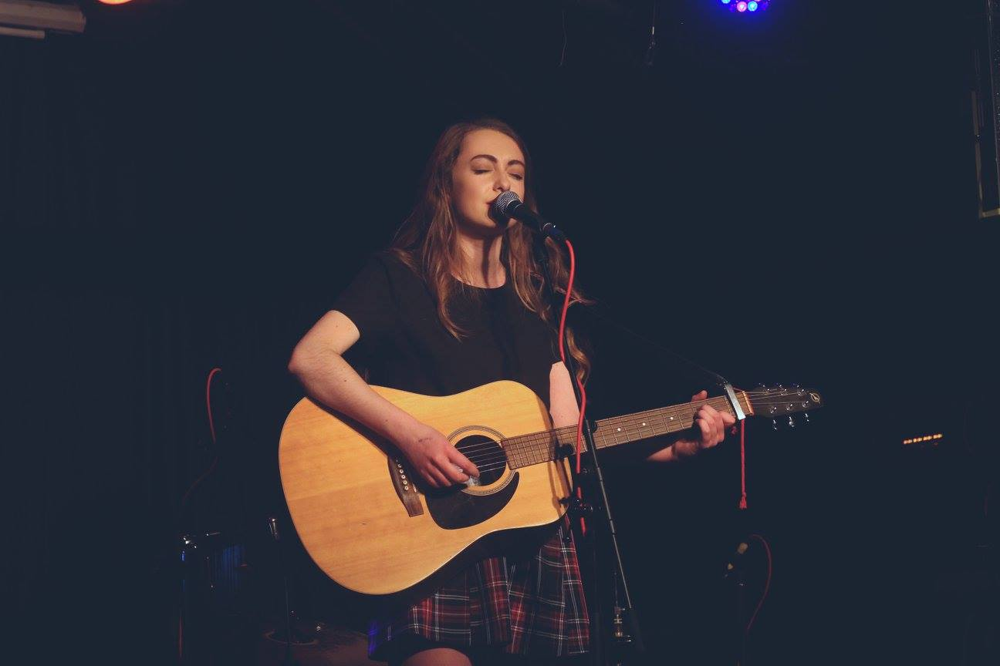
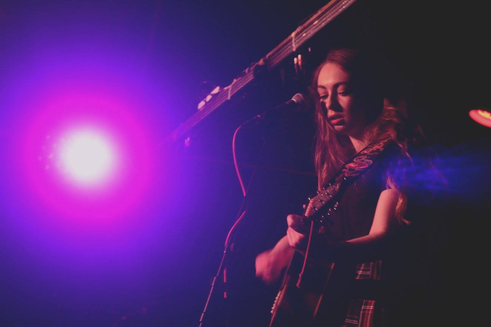
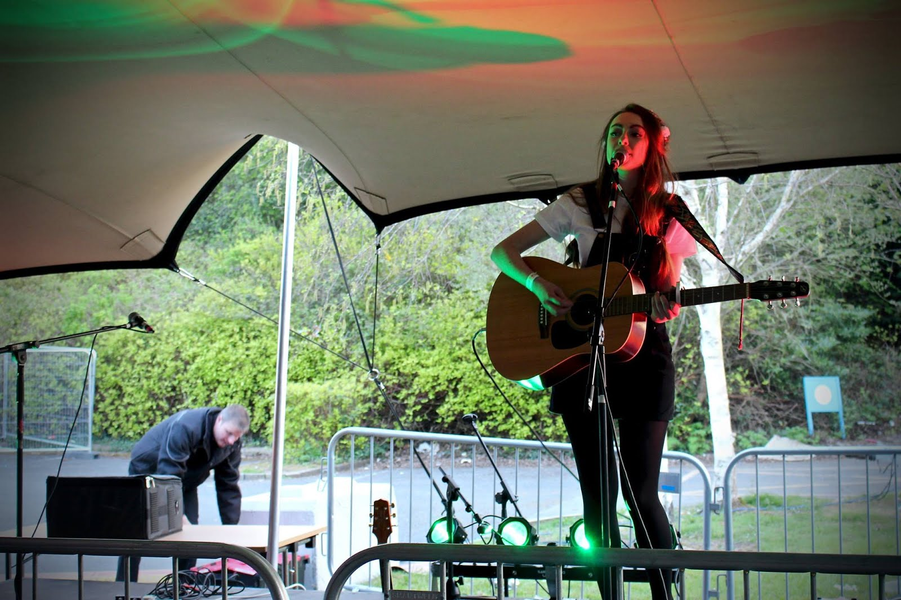

There's a particular quote that always seems to come back to me every time I upload or write a new song: "Being an artist means means forever healing your wounds and at the same time endlessly exposing them". 
Now before you go running away thinking this blogpost is about to get all deep and real,  I don't mean that in an overly cheesy way... bare with me here. 

> Being an artist means means forever healing your wounds and at the same time endlessly exposing them 

There's just something really strange about exposing yourself and showing the internet a song that you completely wrote on your own, using your emotions, your words, your feelings. This month, I uploaded my first original to the channel. It wasn't the first song I'd ever written, and it certainly wasn't the best, but I uploaded it anyway to get feed back and to upload something I actually had a connection to, rather than a song I had heard on the charts. The covers I upload use someone else's lyrics, melodies, chord patterns ... and I wanted to show something I had completely created myself from scratch.
I uploaded the song in a cafe in Dublin after work and let me tell you ... THE FEAR WAS REAL. I suddenly cared what people would think of the video. Would they like the lyrics? Was the melody too cheesy? WOULD SOMEONE THINK IT'S ABOUT THEM?!

This is a feeling I felt all too much recently, especially in terms of releasing my own original songs on iTunes. There's something so damn scary about it all.

The original song I uploaded this month was a song called "Someone Else" (I'll put a link to it below). If you've heard it, then it's pretty obvious what it's about: "Now you've got some feelings you can't help, 'cause you've seen them out with someone else". Yeah. Emotions. And things. 
BUT! The reaction to this video was INSANE. I think it got 100 views in less than 24 hours, and my god my twitter feed was filled with such lovely comments, retweets and favourites! It really made the panic and fear of uploading an original song worth it! I wrote the song about a situation that made me sad, and you turned it into something that made me happy.

So I've decided that in July and August I will be uploading 2 more original songs. I might try and upload more but only if a song feels like it would do better as an acoustic song, recorded in my bedroom rather than a fancy shmancy recorded and professionally produced song.

So that's me. I'm scared. But I'm happy. And I want to thank anyone who told me they enjoyed my original on the channel. You are all sound. 

Don't forget to be kind 

Photo credit: Eleanor Rodgers 

Photo credit: Eleanor Rodgers 

Photo credit: MSU Ents 

